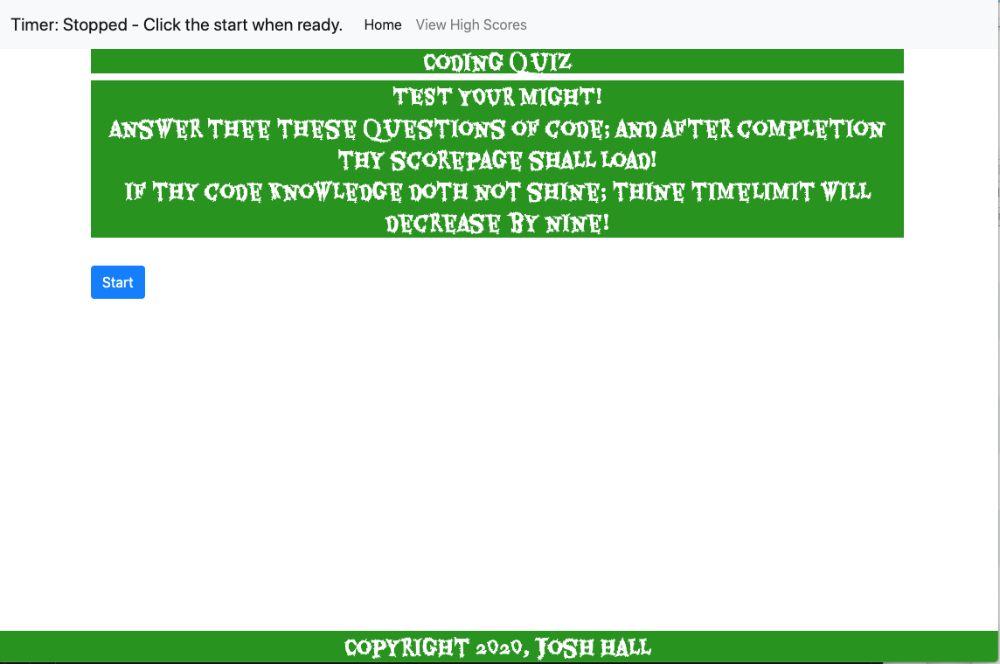

# Code-Quiz-

A code quiz game for UR coding bootcamp

    >TEST YOUR MIGHT!  
    				Answer thee these questions of code; and after completion
    				thy scorepage shall load!  
    				If thy code knowledge doth not shine; thine timelimit will
    				decrease by nine!

GIVEN I am taking a code quiz 
WHEN I click the start button 
THEN a timer starts and I am presented with a question 
WHEN I answer a question 
THEN I am presented with another question 
WHEN I answer a question incorrectly 
THEN time is subtracted from the clock 
WHEN all questions are answered or the timer reaches 0 
THEN the game is over 
WHEN the game is over 
THEN I can save my initials and score 

